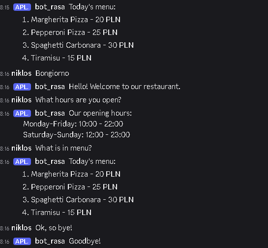

Czatbot Rasa Resturacja

Czatbot powinien być zintegrowany z minimum jednym czatem: slack,
discord, messenger, ale nalezy wykorzystać framework Rasa
(https://rasa.com/).

3.0 Nalezy zaimplementować minimum 3 ściezki (stories) - wykrywać
intencję (intent) DONE
3.5 Informację o godzinach otwarcia restauracji nalezy pobierać z
pliku (action) DONE
4.0 Bot potrafi wyświetlić menu z pliku DONE
4.5 Bot potrafi zebrać zamówienie i je podsumować DONE
5.0 Bot potrafi zebrać adres dostawy NIE

Crawler w Ruby
Należy stworzyć crawler produktów na Amazonie lub Allegro w Ruby
wykorzystują bibliotekę Nokogiri.
3.0 Należy pobrać podstawowe dane o produktach (tytuł, cena), dowolna
kategoria
3.5 Należy pobrać podstawowe dane o produktach wg słów kluczowych
4.0 Należy rozszerzyć dane o produktach o dane szczegółowe widoczne
tylko na podstronie o produkcie

REST API pod sklep Lua
Należy stworzyć REST API z modelami na bazie frameworka Lapis w Lua
lub MoonScript (https://moonscript.org/).
3.0 Endpointy podN kategorie oraz produkty CRUD (Create, read (wiele,
jeden), update, delete) zrobione na listach zwracane w formie JSONów
3.5 Należy modele stworzyć za pomocą lapis.db.model
4.0 To wszystko co wcześniej, ale w MoonScript
4.5 Zapis obrazów (PNG/JPG) produktów na GCS:
https://github.com/leafo/cloud_storage lub innej chmurze
5.0 Testy API, np. za pomocą paczek
https://kyne.com.au/~mark/software/lua-cjson-manual.html,
https://github.com/diegonehab/luasocket

Kółko i krzyżyk

W ramach pierwszego zadania proszę wykonać grę kółko i krzyżyk w
Bashu, który:
3.0 - działa w trybie gry turowej,
4.0 - pozwala na zapis i odtwarzanie przerwanej gry (save game),
5.0 - pozwala na grę z komputerem.

Sklep w ReactJS + NodeJs
Należy stworzyć prosty sklep z serwerem REST API
3.0 Aplikacja ma podstawowe endpointy w NodeJS (np. Express) do
produktów i kategorii
3.5 Dane zapisywanie są w bazie danych po stronie NodeJS
4.0 Axios wykorzystany do wywołań
4.5 Opcja koszyka i płatności działa na React Hook
5.0 Konfiguracja CORS po stronie NodeJS + konfiguracja po stronie
ReactJS

